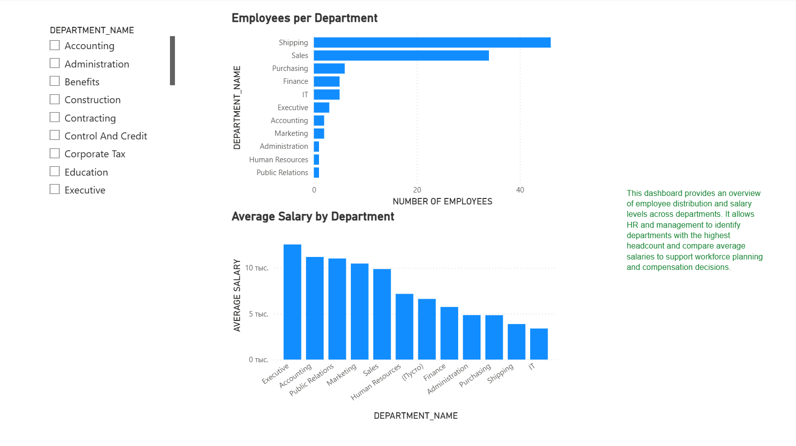

# Power BI HR Analytic Project 

## Description 
This project presents an HR analytics dashboard built in Power BI. 
It analyzes employee distribution and salary levels using Oracle HR sample data. 

## Pages 
### 1. HR Overview
- Employees per department
- Average salary by department

### 2. High Salary Employees 
- Employees earning above company average
- Department slicer for analysis !
  
[High Salary](screenshots/page2_high_salary_employees.PNG) 

## Tools
- Power BI Desktop
- Oracle HR sample schema
